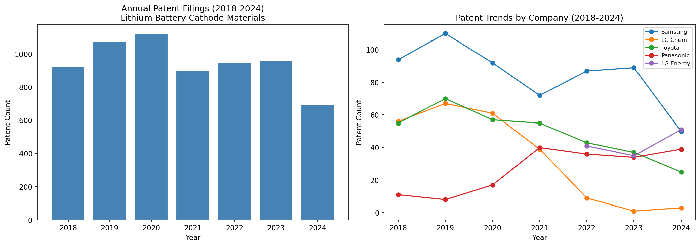
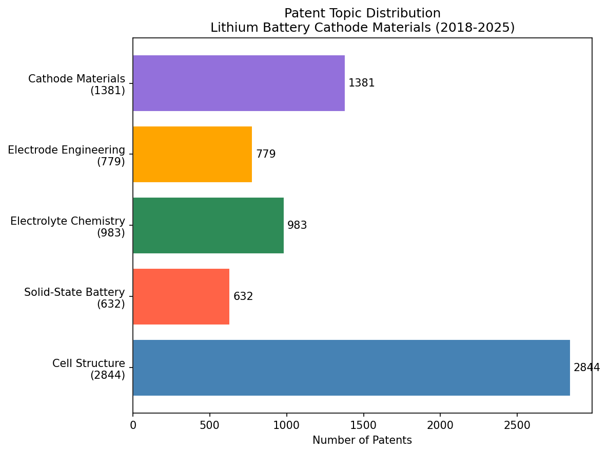

# Lithium Battery Cathode Patent Analysis (2018–2025)

NLP topic modeling and competitive intelligence analysis of global lithium battery cathode material patents.

## Project Overview
This project analyzes 6,619 patents related to lithium battery cathode materials filed between 2018 and 2025, sourced from the PatentsView database. The analysis covers competitive landscape, annual filing trends, and technology topic modeling.

## Methods
- **ETL**: Chunk-based processing of 1.1GB raw TSV files into SQLite database
- **SQL Analysis**: Multi-table JOIN queries in DataGrip to analyze assignee competition and yearly trends
- **NLP**: TF-IDF vectorization + KMeans clustering to identify 5 core technology topics
- **Visualization**: Matplotlib charts for trend analysis and topic distribution

## Key Findings
- Samsung Electronics leads with 594 patents; Toyota and LG follow
- LG Chem patent filings dropped sharply after 2021 due to LG Energy Solution spin-off
- 5 technology clusters identified: Cell Structure, Solid-State Battery, Electrolyte Chemistry, Electrode Engineering, Cathode Materials

## Tech Stack
Python · Pandas · Scikit-learn · NLTK · SQLite · DataGrip · Matplotlib

## Visualizations

